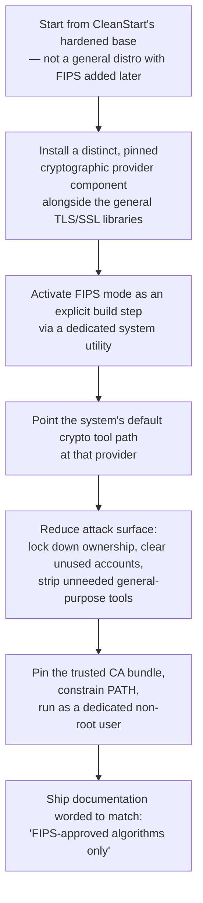

# FIPS-Approved Algorithms in Containers: How CleanStart Builds It In

> Built using only FIPS-approved algorithms — a sequence of steps followed at every build to be compliant.

| The claim | FIPS compliant | FIPS validation |
|---|---|---|
| **Built using only FIPS-approved algorithms** | Build-time enforcement, on every build | A CMVP certificate would be FIPS validated - which is in progress |

---

## The step by step achieving FIPS complaince

> **Why pin the provider instead of letting it resolve at build time?**
> An unpinned dependency can silently swap in a different build of the same library on a routine rebuild — and that's exactly the moment a disallowed algorithm could slip back in unnoticed. Pinning turns "should still be true" into "verified true at this exact build."

> **Why strip tools like compilers, remote-access daemons, and fetchers instead of just disabling them?**
> A tool that's absent can't be re-enabled by a misconfiguration later. Removing the *carrier* is a stronger guarantee than disabling it in config — the same logic applied to legacy crypto packages never entering the base image in the first place.

---

## What each step is actually protecting against

| Step | Without it | With it |
|---|---|---|
| Hardened base, not general distro | Legacy algorithm support rides in with the OS packages | Nothing to disable — it was never installed |
| Pinned crypto provider | A routine rebuild can silently swap library versions | The exact provider in use is known and fixed |
| Explicit FIPS-mode activation | Relies on an operator remembering a runtime flag | Enforced at build time, unconditionally |
| System crypto path redirected | Some tool could still reach an unconstrained implementation | Anything using the standard path gets the constrained one |
| Attack-surface reduction | Leftover tools can introduce new code paths or be used to tamper post-build | Nothing left to misuse |
| Non-root runtime, pinned CA bundle | Broader permissions and TLS trust than needed | Least privilege, known trust store |

---

## What's still the customer's responsibility

| Area | Why it's not CleanStart's to close |
|---|---|
| Turning "available" into "used" | The build controls what's reachable and what runs by default — an application can still be written to call a disallowed algorithm through its own logic |
| Key management and everything outside the image | The build constrains what's inside the image — not how keys are generated, stored, or rotated elsewhere in the user's stack |

---

## How CleanStart follows the FIPS 140-2/140-3 standard

FIPS 140-3 defines below requirement areas a cryptographic module must satisfy. CleanStart's build practice touches all of them:

- **Cryptographic Module Specification** — the boundary and the pinned crypto provider are decided before the build starts, not discovered after
- **Cryptographic Module Interfaces** — every path back to that provider is locked in, and anything outside it is removed
- **Roles, Services, Authentication** — the container runs as one low-privilege, non-root user, with no unused accounts left behind
- **Software/Firmware Security** — nothing resolves at build time; every component is pinned to a known version, so what ships is what was checked
- **Operational Environment** — attack surface is stripped down, not configured down
- **Physical Security** — doesn't apply the way it would to a hardware module; this is software on general-purpose compute
- **Non-Invasive Security** — side-channel resistance rides on an established, pinned provider rather than custom code
- **Sensitive Security Parameter Management** — secrets stay out of the image; the trusted CA bundle is pinned
- **Self-Tests** — FIPS mode runs its own self-test on every load
- **Life-Cycle Assurance** — the same checks re-run on every rebuild, not once and forgotten
- **Mitigation of Other Attacks** — reduced surface and least privilege are the levers against everything else

Attaching the official source for reference - https://www.atsec.com/wp-content/uploads/2024/05/FIPS-140-3-overview-1.pdf

That's every area addressed by cleanstart during build practice.